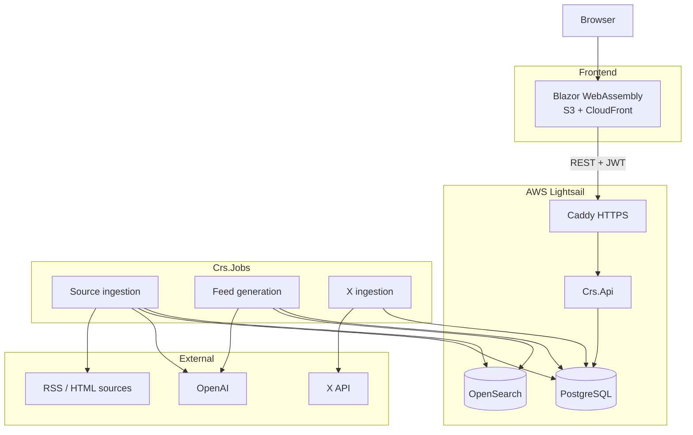

# Content Recommendation System

Content Recommendation System (CRS) aggregates content from your chosen sources (e.g. papers, videos, blogs) and delivers a personalized daily feed. CRS automatically ingests new content, uses AI-driven ranking to surface what's most relevant to you, and lets you refine recommendations over time. It aggregates content from the sources you care about, filters out the noise, and delivers a small, intentional set of recommendations instead of an endless feed.

This helps solve a few common problems:

- **One place for everything**: consolidate many sources into a single daily feed, so you don't have to bounce between platforms.
- **Explicit user-controlled feedback**: steer the algorithm with simple upvotes/downvotes, rather than opaque tracking and "engagement" signals used in other platforms.
- **Built-in limits**: cap the amount of content surfaced so discovery stays focused and finite to prevent endless scrolling.

## Overview

CRS provides:

- **Add and manage URL-based sources** (RSS feeds, video sources, blogs, newsletters, etc.) organized by content category.
- **Automatically ingest and aggregate** learning content from these sources using LLM-powered agents.
- **Provide personalized feeds** for different content types:
  - Papers
  - Videos
  - Blogs
- **Hybrid recommendation engine** combining vector embeddings with heuristic signals for personalized content discovery.
- **Vote on content** (upvote/downvote) to refine recommendations based on your preferences.
- **Connect X accounts** to show a personalized X feed above recommendations (read-only, user selects followed accounts).

## Architecture

CRS splits interactive traffic from ranking work. The Blazor WebAssembly client talks to the ASP.NET Core API over JWT. The API reads and writes application data in PostgreSQL, including pre-generated feeds. `Crs.Jobs` runs on a schedule (locally via `scripts/run-job.sh`), ingests sources, indexes embeddings in OpenSearch, and writes ranked feeds back to PostgreSQL so feed pages stay a database read.



## Local Development Setup

### Prerequisites

- **.NET 10 SDK**
- **Docker** and **Docker Compose** (for local PostgreSQL and OpenSearch)
- **OpenAI API key** (embeddings and LLM ingestion)
- **WSL2 on Windows** recommended for Docker-backed OpenSearch

### Clone The Repository

```bash
git clone https://github.com/your-org/content-recommendation-system.git
cd content-recommendation-system
```

### Start Local Services

```bash
docker compose up -d postgres opensearch
```

This starts PostgreSQL on port `5432` and OpenSearch on port `9200`. The API applies EF Core migrations on startup.

### Configure The Environment

Copy the local secrets template and add your values:

```bash
cp src/Crs.Api/appsettings.Development.local.json.example src/Crs.Api/appsettings.Development.local.json
```

Edit `src/Crs.Api/appsettings.Development.local.json` with a secure JWT secret (32+ characters). Set your OpenAI key via environment variable or `appsettings.json`:

```bash
export OpenAI__ApiKey=sk-your-openai-key
```

See `src/Crs.Api/appsettings.json`, `src/Crs.Jobs/appsettings.json.example`, and `infrastructure/aws/secrets.env.example` for the full configuration surface.

### Install Dependencies

```bash
dotnet restore
```

### Start The App

Run the API and web UI in separate terminals:

```bash
dotnet run --project src/Crs.Api
dotnet run --project src/Crs.Web
```

Or start the full containerized stack:

```bash
docker compose up
```

### Verify It's Working

- Open the web UI at `http://localhost:5250` (or `http://localhost:5001` with Docker Compose)
- Check API health at `http://localhost:5235/health` (or `http://localhost:8080/health` with Docker Compose)
- Use development login from the web UI when `DevelopmentLogin:Enabled` is true

### Run Background Jobs

```bash
# Daily pipeline: x-ingestion, then ingestion, then feed if ingestion succeeded
./scripts/run-job.sh

# One job
./scripts/run-job.sh x-ingestion
./scripts/run-job.sh reindex
```

On Windows, run from Git Bash or WSL.

## License

This project is licensed under the [GNU General Public License v3.0](LICENSE).
